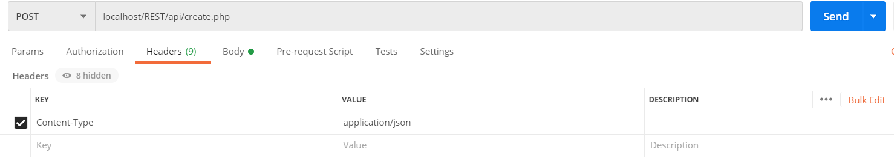
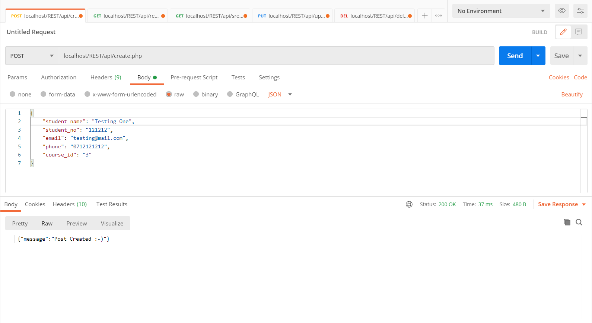
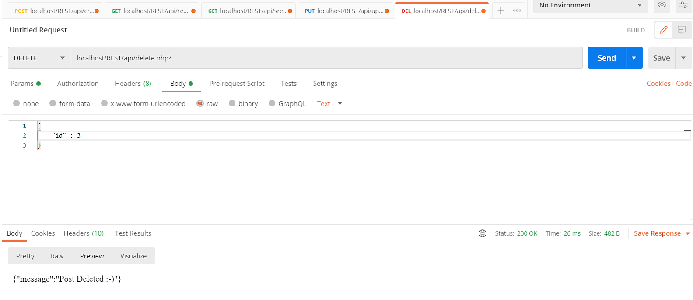

# Rest-API
A restful service to create, update and delete student records.
REST (Representational State Transfer) used to take advantage of existing protocols especially http protocols for web APIs.

The project was done using:
- mysql database
- php
- Postman : colaboration platform for API development

1. [initialise.php](https://github.com/AmaniUsagi/Rest-API/blob/main/core/initialise.php) defines directories, paths for resources and loads configurations.
2. [post.php](https://github.com/AmaniUsagi/Rest-API/blob/main/core/post.php) contains all the functions for manupulating records.

User can create, retrieve, update and delete records as shown below
- Specifying the content type to be pushed to db

- Creating record in db

- Note that the process of creating and updating records are similar. The only difference is that creation uses a POST method while update uses a PUT method.
- The different functionalities are separated in indivitual files
- Retrival uses GET method. To read multiple records use [read.php](https://github.com/AmaniUsagi/Rest-API/blob/main/api/read.php).

- To read a single record use [sread.php](https://github.com/AmaniUsagi/Rest-API/blob/main/api/sread.php). In this case specify the id to retrive.

- DELETE

# How to use?
- Download and run boy! Its that simple.
- Define your site route in the [initialise.php](https://github.com/AmaniUsagi/Rest-API/blob/main/core/initialise.php) file.

